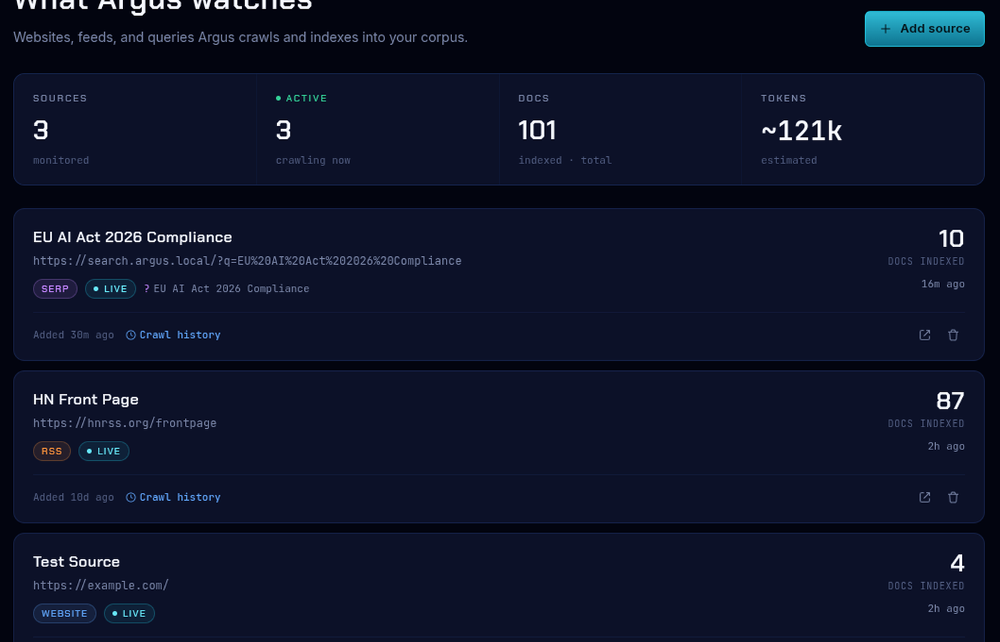
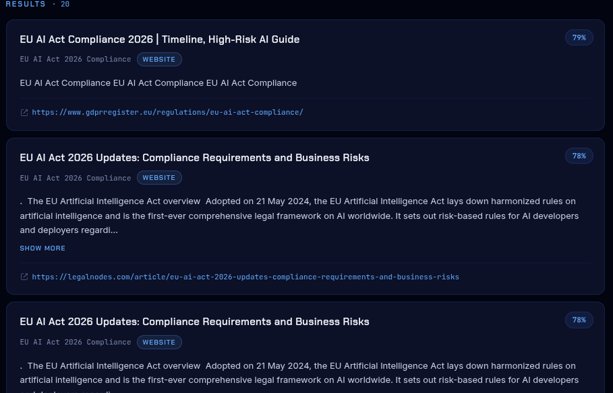
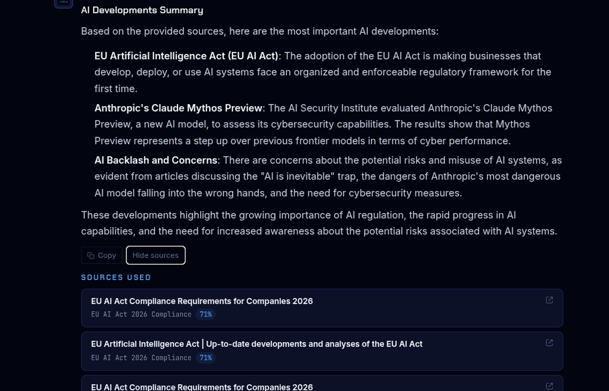
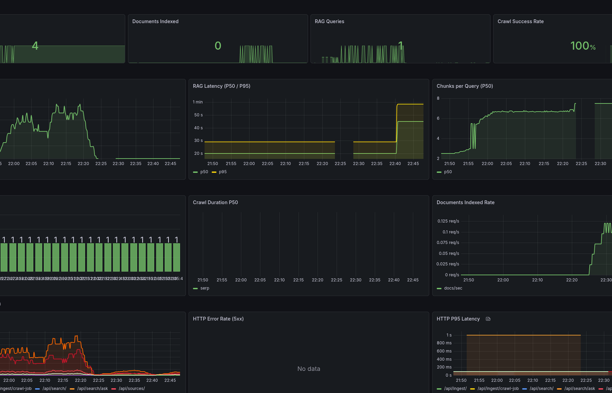
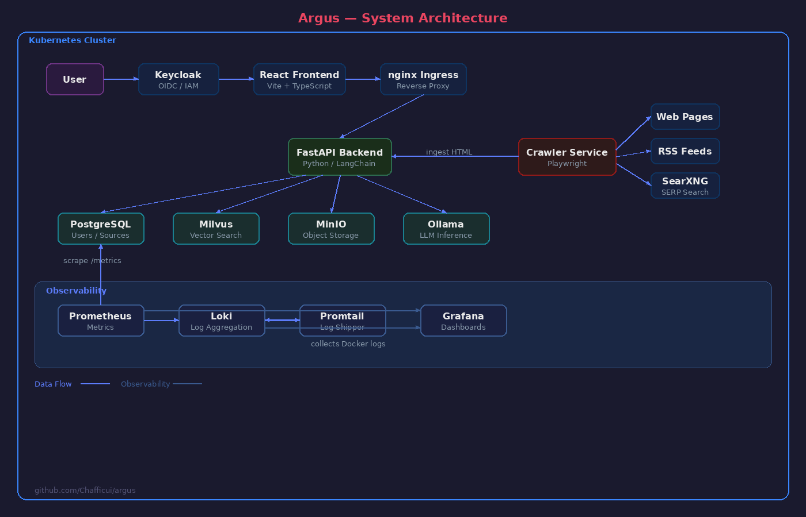

# Argus

[](LICENSE)
[](https://www.python.org/downloads/)
[](https://react.dev/)
[](https://www.typescriptlang.org/)

**Self-hosted AI research platform for monitoring web sources and answering questions with RAG.**

Argus continuously crawls websites, RSS feeds, and search engine results, indexes the content into a vector database, and lets you ask natural-language questions across everything it has collected. Fully on-premise — your data never leaves your infrastructure.

## Screenshots

<table>
  <tr>
    <td><b>Sources</b> — manage monitored websites, RSS feeds, and SERP queries</td>
    <td><b>Search</b> — semantic search with relevance scores and source filter</td>
  </tr>
  <tr>
    <td></td>
    <td></td>
  </tr>
  <tr>
    <td><b>Chat</b> — RAG-powered Q&A with source citations</td>
    <td><b>Grafana</b> — observability dashboard with real-time metrics</td>
  </tr>
  <tr>
    <td></td>
    <td></td>
  </tr>
</table>

## Architecture



| Component | Role |
|---|---|
| **React Frontend** | Dashboard UI — Sources, Search, Chat pages with Observatory design system |
| **FastAPI Backend** | REST API, document processing, RAG pipeline |
| **Crawler Service** | Playwright-based scraping of websites, RSS, and SearXNG SERP results |
| **PostgreSQL** | Relational storage for users, sources, documents, crawl jobs |
| **Milvus** | Vector database for semantic similarity search |
| **Ollama** | Local LLM inference for embeddings (nomic-embed-text) and answers (llama3.2) |
| **MinIO** | S3-compatible object storage for raw and processed documents |
| **Keycloak** | OpenID Connect identity provider with PKCE |
| **Prometheus + Grafana** | Metrics collection and auto-provisioned dashboards |
| **Loki + Promtail** | Log aggregation with Docker container discovery |
| **SearXNG** | Self-hosted meta search engine for SERP source type |

## Quick Start

Prerequisites: [Docker](https://docs.docker.com/get-docker/) and [Docker Compose](https://docs.docker.com/compose/install/).

```bash
# Clone the repo
git clone https://github.com/Chafficui/argus.git
cd argus

# Start the full stack
docker compose -f docker-compose.dev.yml up -d

# Pull the required Ollama models (first run only)
docker exec argus-ollama ollama pull nomic-embed-text
docker exec argus-ollama ollama pull llama3.2
```

Wait for all services to become healthy (~60s), then open the frontend:

| Service | URL | Credentials |
|---|---|---|
| **Frontend** | http://localhost:5173 | demo / demo |
| **Backend API** | http://localhost:8000/docs | — |
| **Grafana** | http://localhost:3000 | admin / admin |
| **Keycloak Admin** | http://localhost:8081 | admin / admin |
| **Prometheus** | http://localhost:9090 | — |
| **MinIO Console** | http://localhost:9001 | argus-minio / argus-minio-secret |
| **SearXNG** | http://localhost:8888 | — |

### First steps

1. Log in at http://localhost:5173 with **demo / demo**
2. Go to **Sources** and add an RSS feed (e.g. `https://hnrss.org/frontpage`)
3. The crawler picks it up automatically and indexes documents
4. Go to **Search** and query your indexed content
5. Go to **Chat** and ask questions — Argus answers with source citations

## Stack

| Layer | Technology |
|---|---|
| Frontend | React 19 + TypeScript + Vite + Tailwind CSS v4 |
| Backend | Python 3.12 / FastAPI |
| LLM Inference | Ollama (on-premise, OpenAI-compatible) |
| Vector DB | Milvus |
| Auth / IAM | Keycloak (OIDC + PKCE) |
| Object Storage | MinIO |
| Relational DB | PostgreSQL |
| Observability | Prometheus + Grafana + Loki + Promtail |
| Crawling | Playwright + SearXNG |
| Orchestration | Docker Compose (dev) / Kubernetes + Helm (prod) |

## Development

### Backend

```bash
cd services/backend
python -m venv .venv
source .venv/bin/activate
pip install -r requirements.txt -r requirements-test.txt

# Run tests (no Docker needed)
pytest
```

### Crawler

```bash
cd services/crawler
python -m venv .venv
source .venv/bin/activate
pip install -r requirements.txt -r requirements-test.txt

pytest
```

### Frontend

```bash
cd services/frontend
npm install
npm run dev     # Vite dev server on :5173
npm run build   # Production build
npm run lint    # ESLint
```

### Environment Variables

All configuration is managed through environment variables via [pydantic-settings](https://docs.pydantic.dev/latest/concepts/pydantic_settings/). Defaults are tuned for local development with `docker-compose.dev.yml`. See [config.py](services/backend/app/core/config.py) for the full list.

| Variable | Default | Description |
|---|---|---|
| `ENVIRONMENT` | `development` | `development` or `production` |
| `DEV_AUTH_BYPASS` | `false` | Skip JWT validation in development |
| `POSTGRES_HOST` | `localhost` | PostgreSQL hostname |
| `MILVUS_HOST` | `localhost` | Milvus hostname |
| `OLLAMA_BASE_URL` | `http://localhost:11434` | Ollama API endpoint |
| `LOG_LEVEL` | `info` | Logging level |

## Project Structure

```
argus/
├── docs/                         # Architecture diagram, screenshots
├── infra/                        # Prometheus, Grafana, Loki, Keycloak configs
│   ├── prometheus.yml
│   ├── promtail.yml
│   ├── keycloak/argus-realm.json
│   └── grafana/provisioning/     # Auto-provisioned datasources + dashboards
├── services/
│   ├── backend/                  # FastAPI backend (Python 3.12)
│   ├── crawler/                  # Playwright crawler (Python 3.12)
│   └── frontend/                 # React + TypeScript + Vite
├── docker-compose.dev.yml        # Full local dev stack (14 services)
├── CONTRIBUTING.md
└── LICENSE
```

## Contributing

See [CONTRIBUTING.md](CONTRIBUTING.md) for commit conventions, branch naming, and code style guidelines.

## License

[MIT](LICENSE) — Felix Beinssen
